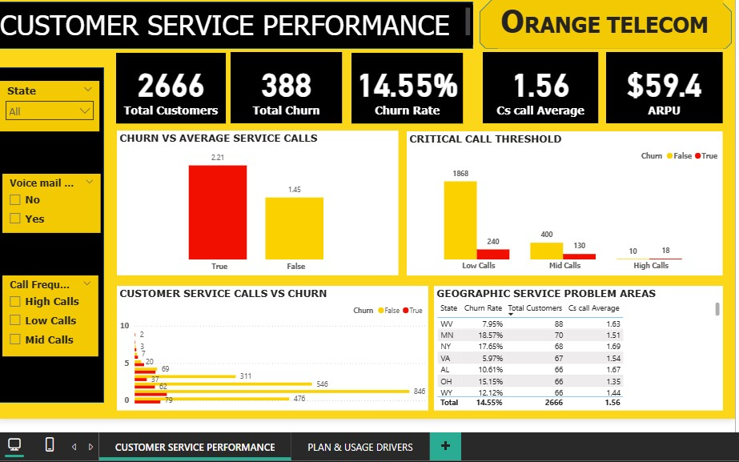
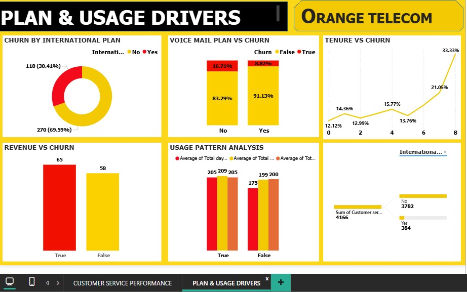

# Orange-Telecom-Churn-Analysis-Dashboard

# 🚀 Project Overview

This project was developed as part of the Codeant Technology Hub – Talent Pool Mentorship Program and It focuses on data-driven analysis of customer churn behavior for Orange Telecom using Power BI.The goal is to uncover key factors driving customer attrition and provide actionable insights to improve retention strategies.

The dashboard focuses on two major areas:

📞 Customer Service Performance

📈 Plan & Usage Drivers

# 🎯 Objectives

Identify the impact of customer service interactions on churn

Analyze how plan subscriptions influence customer retention

Evaluate usage patterns and revenue behavior of churned customers

Detect high-risk customer segments for proactive retention

# 📂 Dataset Description

The dataset contains 2,666 customers with features such as:

- Customer service calls

- Call usage (day, evening, night, international)

- Charges and billing information

- Plan subscriptions (International & Voice Mail)

- Account length (tenure)

- Churn status (Target variable)

# 📊 Dashboard Structure
### 1️⃣ Customer Service Performance Dashboard

Key KPIs

Total Customers: 2,666

Total Churn: 388

Churn Rate: 14.55%

Avg Customer Service Calls: 1.56

ARPU: $59.4

### Key Visuals

- Churn vs Average Service Calls

- Critical Call Threshold Analysis

- Customer Service Calls vs Churn Distribution

- Geographic Service Problem Areas

# 2️⃣ Plan & Usage Drivers Dashboard

### Key Visuals

- Churn by International Plan

- Voice Mail Plan vs Churn

- Tenure vs Churn Trend

- Revenue vs Churn

### Usage Pattern Analysis

🔍 Key Insights
📞 Customer Service Impact

- Churned customers make more service calls (2.21 vs 1.45)

- High call frequency strongly correlates with churn

- A critical threshold (3+ calls) signals high churn risk

### 🌍 Geographic Insights

- Certain states show higher churn and service call rates

- Indicates regional service quality issues

### 📦 Plan Subscription Insights

- Customers with International Plans churn more

- Customers with Voice Mail Plans churn less

### 💰 Revenue Insights

- Churned customers generate higher revenue (~$65 vs $58)

- Indicates loss of high-value customers

### 📈 Usage Behavior

- Heavy users (higher minutes & charges) are more likely to churn

- Suggests price sensitivity or dissatisfaction

### ⏳ Tenure Analysis

- Churn increases with tenure in later stages

- Indicates long-term retention challenges

# 📌 Business Recommendations

### 1. Improve Customer Service

- Resolve issues within 1–2 interactions

- Escalate cases after 3 calls

### 2. Build Churn Prediction System

- Flag customers with:

- High service calls

- High usage

- Trigger early retention actions

### 3. Optimize Pricing Strategy

- Reassess International Plan pricing

- Benchmark against competitors

### 4. Promote Retention Features

- Encourage Voice Mail Plan adoption

- Bundle with other services

### 5. Retain High-Value Customers

- Introduce loyalty rewards

- Offer personalized incentives

### 6. Fix Regional Issues

- Investigate high-churn states

- Improve infrastructure and support

# 🛠 Tools & Technologies

- Power BI – Dashboard development

- DAX – Measures and calculations

- Power Query – Data transformation

# 🔗 Author

## Christopher Stanley Obinna
